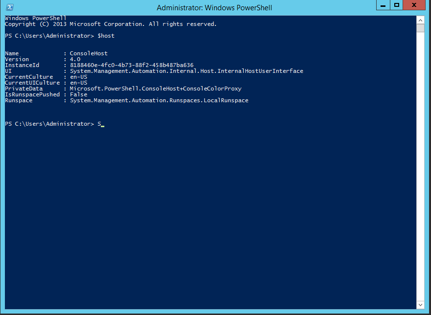
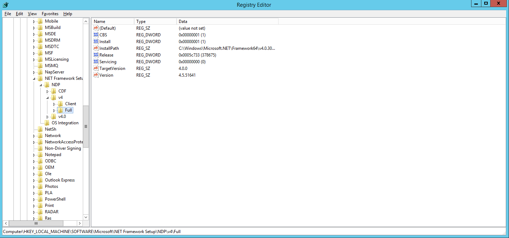
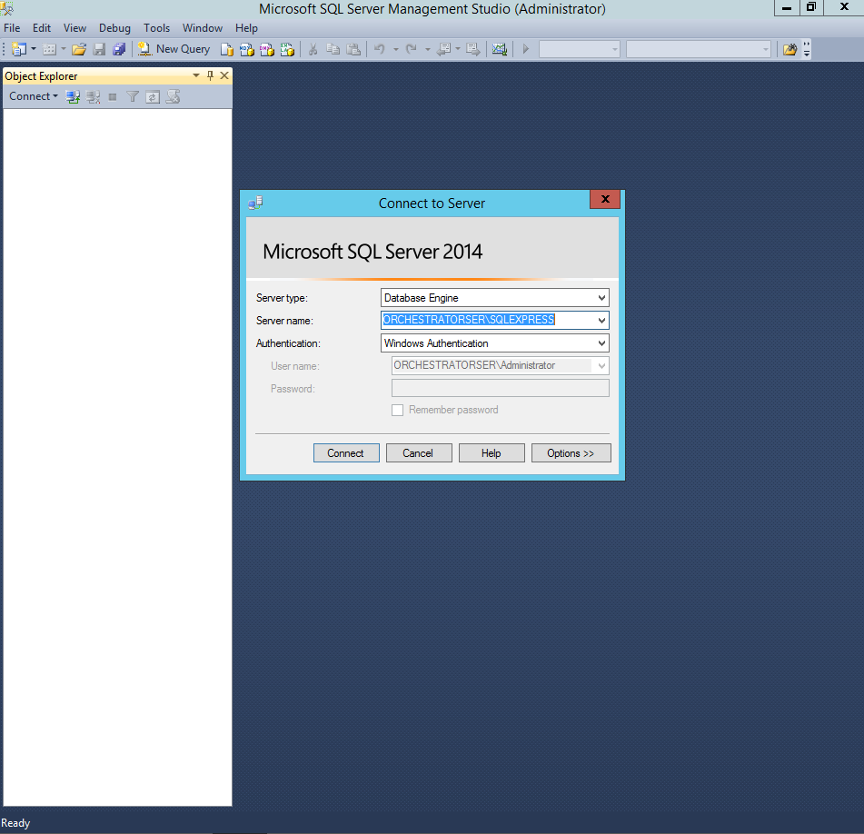
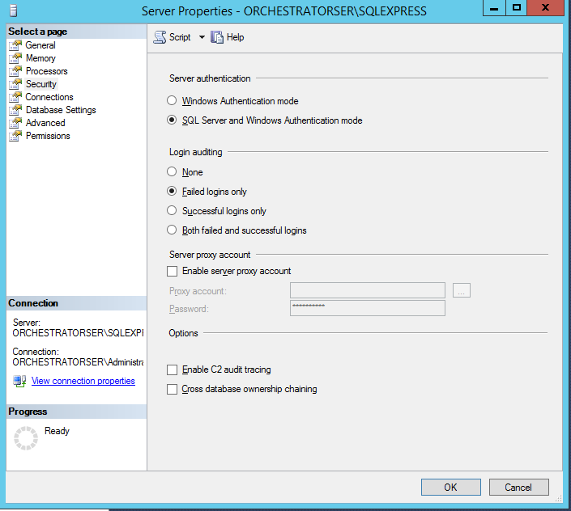
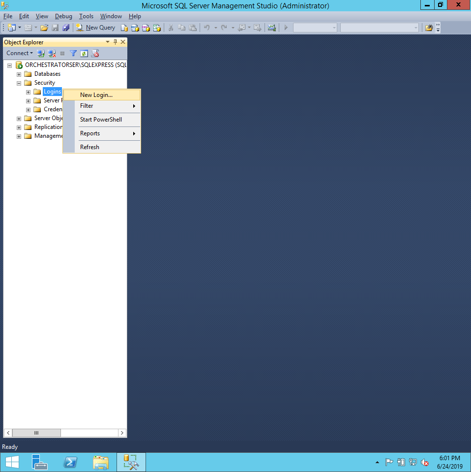
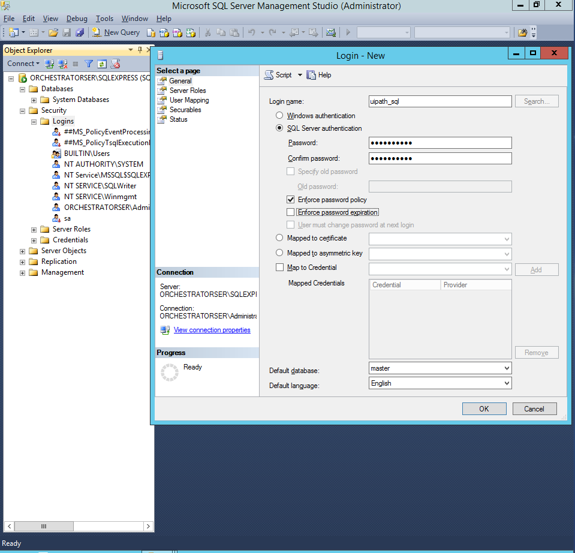
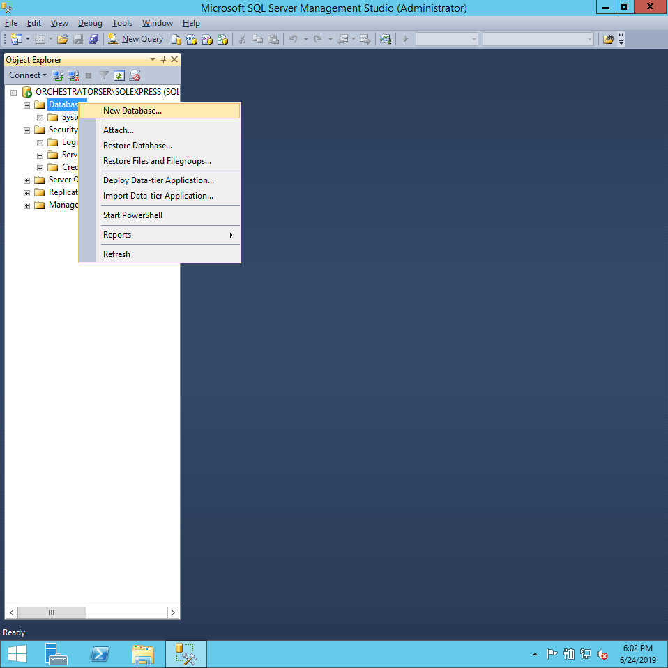
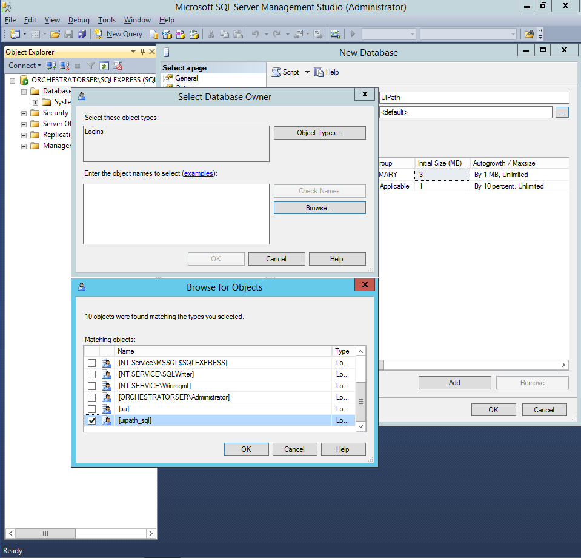
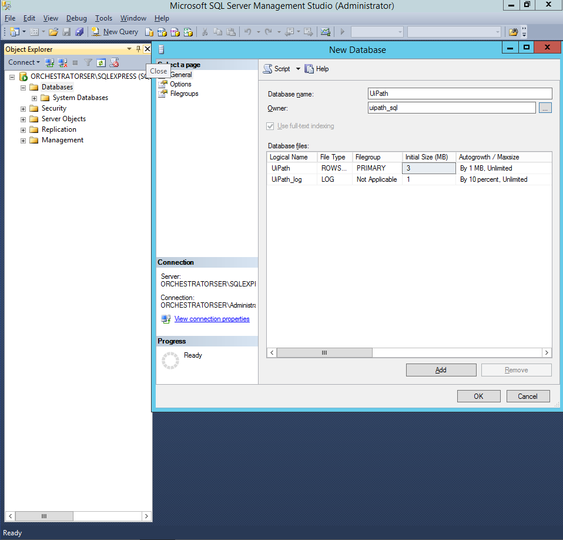
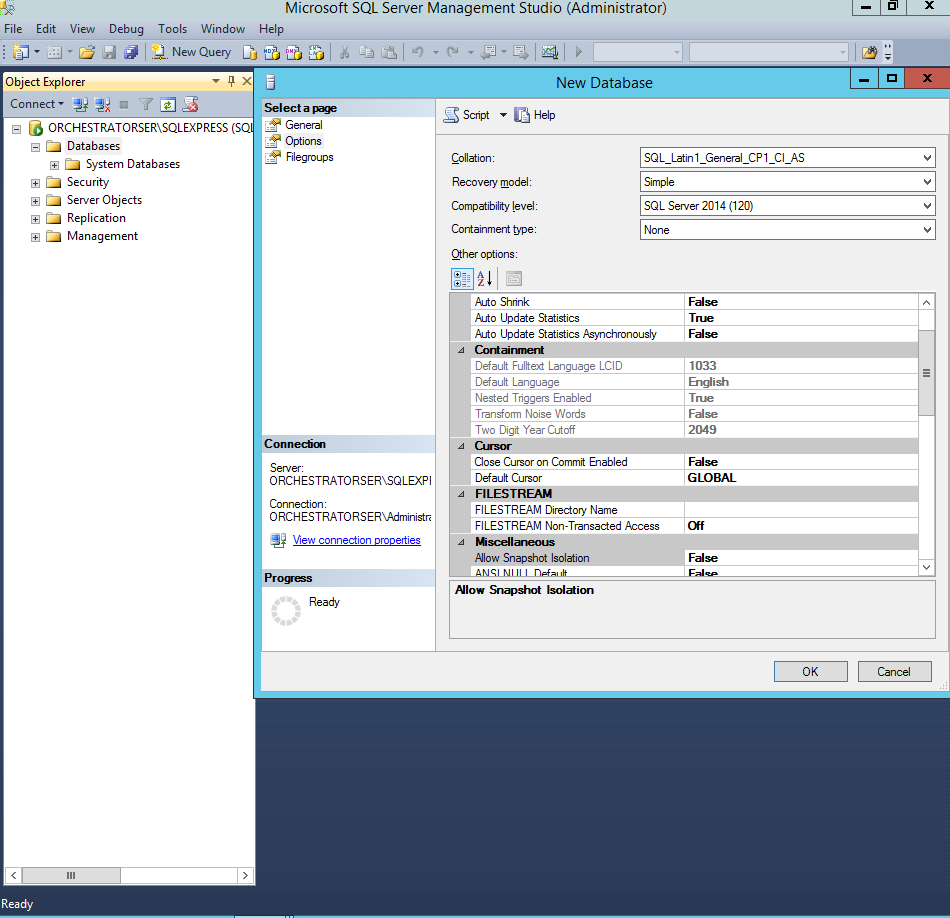

# Orchestrator Install

## 1.하드웨어 사양

* 오케스트레이터를 설치할 하드웨어의 최소 사양은 아래와 같습니다.
    + CPU: 4 cores, 2GHz 
    + RAM: 4GB (8GB 이상을 권장합니다) 
    + Storage: HDD 100GB (SSD를 권장합니다) 
 
* SQL Server를 설치할 하드웨어의 최소 사양은 아래와 같습니다. 
    + CPU: 4 cores, 2GHz
    + RAM: 8GB
    + Storage: HDD 100GB (SSD를 권장합니다) 
 
## 2,소프트웨어 사양

* 오케스트레이터를 구동할 수 있는 운영체제는 아래와 같습니다.
    + Windows Server 2008 R2 SP1 
    + Windows Server 2012 R2 
    + Windows Server 2016 
 
* 오케스트레이터를 호스팅할 수 있는 IIS (Internet Information Services Manager)버전은 7.5 이상입니다. 
 
* 오케스트레이터가 지원하는 SQL Server 버전은 아래와 같습니다.
    + SQL Server 2008 R2 Standard or Enterprise Edition 
    + SQL Server 2012 Standard or Enterprise Edition 
    + SQL Server 2014 Standard or Enterprise Edition 
    + SQL Server 2016 Standard or Enterprise Edition 
    + SQL Server 2017 Standard or Enterprise Edition
 
## 3.체크리스트

* Orchestrator 머신의 호스트 이름에 underscore("_")가 포함되어 있으면 브라우저에서 오케스트레이터 로그인이 동작하지 않는다.
    + 호스트이름에 underscore가 포함되지 않도록 해야 한다. 
    + https://orchestrator_server (X)
    + https://orchestratorserver (O)
    
* Orchestrator 머신의 Internet Explorer 11 이상 또는 Google Chrome 50 이상
* Orchestrator 머신에 설치되어 있는 PowerShell의 버전 4.0 이상
* Orchestrator 머신에 설치되어 있는 .NET Framework의 버전 4.6.1
* Orchestrator 머신의 IIS 버전 7.5 이상
    
## 4.구성환경

* window2012-r2
    + 빌드 9600.17050 EN-US
* .NET Framework
    + 4.7
    + NDP47-KB3186497-x86-x64-AllOS-ENU
* UiPathPlatformInstaller
    + 19.4.3
    + UiPathPlatformInstaller_19_4_3.exe    
* SqlServer
    + 2014
    + SQLEXPR_x64_ENU.exe
* SqlMangerStudio    
    + SQLManagementStudio_x64_ENU.exe
* IIS
    + iisexpress_1_11_x86_en-US (7.5)    
* PowerShell
    + 4.0    
    +     
* Internet Explorer
    + 11 버전
* Rewrite-url
    + rewrite_amd64.msi
* Web-Deploy Extension
    + WebDeploy_amd64_en-US.msi

## 5. .NET Framework 4.7 설치

> window2012-r2의 경우 .NET Framework의 경우 4.5.1이기 때문에 4.7을 설치 해준다.

1. .NET Framework 4.7을 설치 한다.
    1.  NDP47-KB3186497-x86-x64-AllOS-ENU.exe

## 6. PowerShell 4.0 설치

1. 버전 확인
    1. PowerShell을 열고 $host 했을때 버전이 4.0보다 낮으면 설치 하자
        - Windows8-RT-KB2799888-x64.msu 설치

## 7. Web Browser 확인

1. Internet Explorer 11 이상
    - Enterprise Mode 끄기 (레지스트리에 없었음.)
2. Google Chrome 50 이상
    
## 8.SQL Server 설치 및 설정

1. SQL Server를 설치.
    1. SQLEXPR_x64_ENU 실행하여 압축을 품
    2. 압축푼 디렉토리의 SETUP.exe 실행
    3. Installation의 New SQL Server stand-alone ... 실행
    4. 설치
            
2. Sql Server MangementStudio 설치
    1. SQLManagementStudio_x64_ENU를 실행하여 압축을 품
    2. 압축푼 디렉토리의 SETUP.exe 실행
    3. Installation의 New SQL Server stand-alone ... 실행
    4. 설치

3. Server Authentication 설정
    1. SQL Server 2014 Management Studio 실행
    2. 아래 그림과 같이 기본설정으로 Connect를 한다.
    
    3. 데이터베이스의 설정으로 들어 간다.
    
    4. 아래 그림과 같이 Server Authentication을 "SQL Server and Winodws AUthentication mode" 로 설정.
    
     
4. SQL Server 계정 생성
    1. 로그인 항목에 우클릭을 하여 New Login을 들어 간다.
    
    2. 그림과 같이 Orchestrator가 사용할 계정 "uipath_sql"을 생성하고 Default language를 "English" 로 설정.    
    3. 그리고 "Enforce password expiration" 옵션과 "User must change password at next login" 옵션을 해제
        
    
5. SQL Database 생성
    1. 그림과 같이 "Databases"에 우클릭하여 "New Database..."를 선택.
            
    2. Database name에 "UiPath"를, Owner에 "uipath_sql"을 입력 한다.
    
    3. 확인
    
    4. Option메뉴로 들어가 Collation을 "SQL_Latin1_General_CP1_CI_AS"로 설정.
    
    

## 9. IIS 활성화
1. AddServerRolesAndFeatures.zip을 압축을 푼다.
2. PowerShell로 해당 디렉토리에 접근하여
3. ./InstallRolesAndFeatures.ps1 실행 
 
## 10. URL Rewrite 설치

## 11. Web-Deploy Extension 설치

## 12. SSL Certificate

## 13. Orchestrator 설치

1. 인스톨러 설치
    1. UiPathPlatformInstaller_19_4_3.exe 실행
