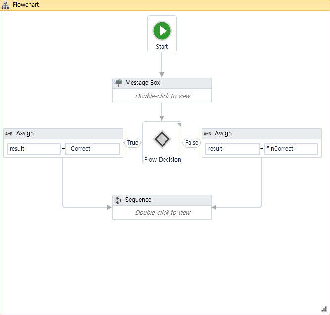
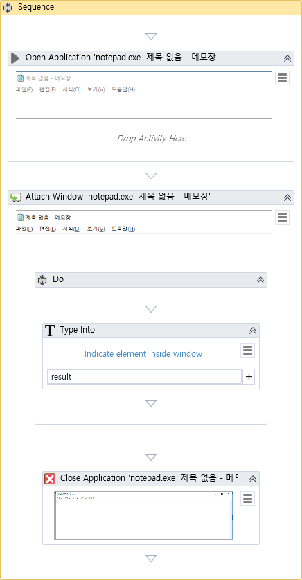

# level1 실습 1

## 방정식이 맞는지 확인후 노트패드 열어서 문구 입력하기

* 메세지 박스의 Buttons를 YesNo 옵션을 사용하여 예/아니오 버튼 사용.
* Open Application : 프로그램을 여는 역할 인듯.
* Attach Window : 프로그램의 포커스를 마추는 역할 인듯.
* Type Into : 텍스트를 적을 수 있는 듯 하다.
* Close Application : 프로그램을 종료 시킬 수 있다.

둘다 햄버거 버튼을 이용하여 실행된 프로그램을 직접 마우스로 클릭하여 바인딩 할 수 있다.

## flow

## sequence

